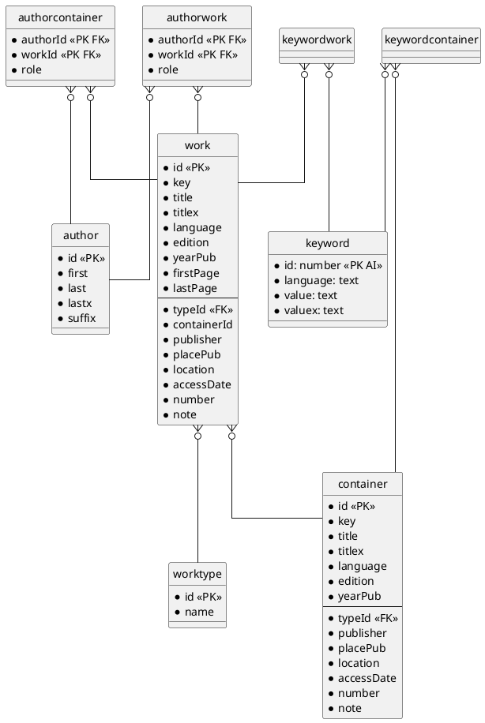
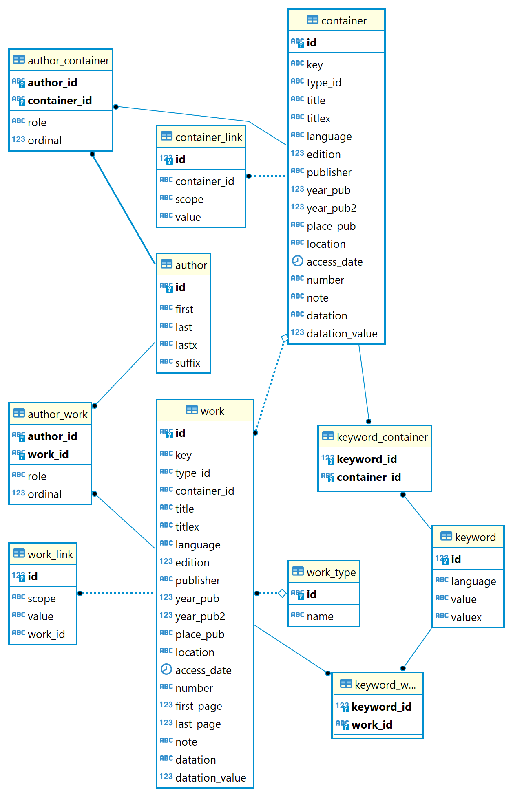

# Cadmus Bibliographic API

Quick Docker image build:

```bash
docker build . -t vedph2020/cadmus_biblio_api:2.1.6 -t vedph2020/cadmus_biblio_api:latest
```

(replace with the current version).

This API is independent from Cadmus, but it is designed to integrate with it. You can find frontend components for both this independent API and Cadmus in [this repository](https://github.com/vedph/cadmus_biblio_shell).

## Overview

This is an API used to expose a minimalist bibliographic database to Cadmus part editors.

The reason behind this project is providing an additional backend to a number of part editors which should share a global bibliographic database, and use references to its items.

Cadmus is mainly focused on producing content in the form of a set of composable, highly structured yet open and modular "documents", which correspond to the Cadmus notion of _item_. Each item contains any number of specialized, independent and reusable models, the _parts_. Using an analogy, you might think of a file system, where Cadmus items are folders, and Cadmus parts are the files inside each folder. Users write edit these files, and each file has its own type and structure. In any moment users can add new files to a folder. The same folder might thus include text documents, spreadsheets, pictures, etc. Each folder has a name, which identifies it, and a set of metadata; apart from this, all the folders are equal; it's what you put inside them which matters. In Cadmus, items are like folders: they have an ID and a set of metadata, and contain any number of parts (files). Each part is a piece of structured data.

This architecture is designed to be open, modular, and easy to use; its main target is content creation, rather than presentation. Thus, usually once content is created it can be variously manipulated by software to generate data optimized for publications; for instance, you might want to build a relational database acting as the data source for a web application publishing some subset of the data. Just like in many software paradigms the data model is different from the view model (a subset of the data restructured in order to provide the optimal source for a UI), here the technologies used for creating data may be different from those used for presenting them.

In most cases, this document-like approach fits the typical content creation process. This is because Cadmus targets scenarios where data models are highly dynamic and modular, and can be changed at any time as the research work progresses. Of course, you can go with more traditional solutions if all your data are already well-defined at the start of the project, and you can be confident in defining and implementing their model as a "closed" structure, which hardly changes in time. In these cases typically you just have to create e.g. a relational database, whose schema is optimized for data normalization and performance, at the price of a more rigid architecture.

## Normalization Levels

Anyway, even in Cadmus there are scenarios where a certain degree of normalization is required. In many cases, it's just a matter of good design and a little convention to deal with them. For instance, say you are building a database with data about all the persons connected to a corpus of letters. In this case, you would have items like letters, persons, manuscripts, etc., each with a number of parts. Some of these parts may be shared across different items (e.g. a part with datation, a part with a generic note, etc.); others instead are more specific. As for persons, you might have several parts which need to reference them: for instance, from a letter's text we might want to reference a person which is cited there, and found in our database. As letters and persons are both items, and each item's part is independent, the easiest way to make such references is sticking to a naming convention, just like you might want to do in a file system. If you were writing a monographic text document about each person, you would store each in a file in a `persons` folder, named after that person (e.g. `petrarca.doc`, `barbato.doc`, etc.). Then, should you need to add a reference to Barbato in the Petrarca document, you would just add the file's name (`barbato`) to refer to its document.

In Cadmus, you can do the same: a part with biographic data about Barbato would also let you enter an arbitrarily chosen, human-readable ID for that person, like `barbato`; another part needing to reference him, e.g. a part listing all the exchanges of manuscripts between Petrarca and Barbato, or a part listing all the pseudonyms used in a letter for various persons, would just address each person with his ID. This intentionally is a loose link between documents: when writing the document about Petrarca, the document about Barbato might even not yet exist; you could anyway use `barbato` to reference him. Using such human-friendly IDs in this scenario is fine, because they are simple to use, understand, and remember, and provide a sort of "weak references". Cadmus can also build lookup lists of similar IDs, and provide it to part editors, so that they can pick an ID from a list rather than typing it (unless it refers to something which is not yet found in the existing data). Of course, in another scenario, where your data are not so various and open to expansion, you might well prefer a relational database, where you can define "strong references" between data, and you also are constrained to them (which can be good or not, according to the data entry processes); but this is not the case of our sample.

This way, you enter all the data you want about each person in a number of different parts under their item; and at any time you can add new parts to enrich the person's data model. When another part needs to refer to a person item, it just picks the ID defined for that person in one of that item's parts.

In other cases you might want to attain a higher level of normalization, or even work with some external data repository. For instance, you might want to provide bibliographic references from an editable, shared bibliographic database; or iconographic references from an external, readonly repository of manuscripts watermarks. In the former case, we're still referencing data inside the domain of our system; in the latter case, we're going to reference data outside it. Yet, the solution in both cases would be the same, thanks to the independence granted to each part in this architecture. Just as the part is an independent data model, its editor UI is an independent piece of software; it gets integrated into the Cadmus framework, but its implementation can be really anything. In this case, we would need to create a part editor which talks to a web service exposing data, either writeable or readonly. Cadmus part editors talk to the Cadmus API service, which reads and writes data from the Cadmus database. In this case, the part editor would talk to an additional service.

For instance, think of a part with biographic data about a person: we might want to add some bibliographic references related to events and works cited in that part. To this end, a reference would just be a conventional citation, built like "Moore 1926", which references a full bibliographic item stored elsewhere using only the author's last name and publication date. In this editor, we would like users wanting to add such a reference to either type it, or be aided in picking it from a list appearing when typing some of the author's letters. For instance, the user just types `moo`, and gets a list of all the bibliographic items whose author's last name match this text. He can then pick the desired item, and have "Moore 1926" automatically inserted as the required reference.

Given that a part editor is just a web "page" with its own HTML-based UI and Javascript code, developers are free to implement any editing logic. The only feature needed here from the framework is getting some parameters, like e.g. the URI to the required service: this could be hardcoded in case of external services, but especially when dealing with in-house developed services, which move according to the environment (development, testing, staging, production...), we have better get the URI from an externally defined parameter. This way, we could e.g. have our custom Docker compose stack including both the Cadmus API service and the bibliography API service, and later move it out of the stack replacing its URL with something else. The Cadmus web editor provides this feature via its `env.js` file, which can be replaced before buliding a Docker image, without recompiling the web app itself. The constants defined there can then be injected into Cadmus components.

## Bibliographic API

This project is an example of such an additional API service, provided for those parts requiring to reference a shared bibliographic repository. As such, its database and API interface are designed to provide just the level of functionality typically required by Cadmus part editors.

### Schema

The bibliographic database here is a MySql database with a very simple schema, centered around the concept of work. Apart from its title and details, the work is connected to these other data:

- a single _work type_, drawn from an editable list (e.g. book, paper, web page, audio recording, TV show...);
- any number of _authors_, with different roles (authors proper have a default role of null; other may be translators, organizations, etc.);
- any number of _keywords_.

Also, works can be contained in another work, acting as a works _container_ (e.g. journal, proceedings, books of articles, etc.). Its schema is equal to that of a work, except that it lacks a container, and first and last page numbers.

(Paste the following code in the box at [PlantUml website](https://plantuml.com/) if you cannot see it):



Alternatively, here is a picture:



Some notes about fields:

- some of the fields are duplicated with an `x` suffix: these are the values of the corresponding x-less field, filtered. The API generates these values when storing data, and filters any incoming text used for matching these values. Filtering means that:

  - whitespaces and whitespace sequences are normalized into a single space, and removed from start/end.
  - only letters and digits and apostrophe (`'`) are preserved.
  - all the diacritics are removed, and uppercase letters are lowercased.

- the `key` field is usually calculated, by concatenating all the first 3 author last names (unfiltered, sorted by their ordinal or -when ordinals are equal- alphabetically, and separated by an ampersand `&`), the number if any, and the publication year. Note sorting authors is required to make the key predictable. This field is used to allow faster lookup by key: clients can thus find the full bibliographic record from its key. When adding/updating a work, if another work with the same key already exists (which is rarely the case, but may happen when the same author(s) publish more than a work in the same year), a letter will be appended to the year (e.g. `Allen 1970b`), up to `z`. Any key field starting with `!` is treated as a manually managed key, and as such is not automatically updated.

### Repository

The database is managed by a repository, which provides these functionalities:

- _works_ (and _containers_): get a filtered paged list, get a work from its ID, add or update a work with its full data graph (authors, keywords, type, container), delete a work.
- _work types_: get a filtered paged list, get a type from its ID, add or update a type, delete a type.
- _authors_: get a filtered paged list, get an author from its ID, add or update an author, delete an author, prune authors.
- _keywords_: get a filtered paged list, get a keyword from its ID, add a keyword, delete a keyword, prune keywords.

## Integrating Resources

This project provides a centralized and independent bibliographic repository, which gets filled by contributions in the Cadmus editor as the parts are edited. It might start empty, or from some imported data. In any case, this would provide a unified lookup system across several different parts.

The main tasks to integrate a service like this in Cadmus are:

- if required, add the same `AuthenticationController` found in Cadmus API and use the same authentication MongoDB database used by Cadmus to authorize the requests to the API. Configure CORS and authentication as required, and protect the desired API endpoints.

- add a layer to the Docker compose stack, dependent from the Cadmus API (to be able to use its authentication DB); the Cadmus web app depends on it.

## Seeding

To empty the database:

```sql
SET FOREIGN_KEY_CHECKS = 0;
TRUNCATE TABLE `authorwork`;
TRUNCATE TABLE `authorcontainer`;
TRUNCATE TABLE `authorwork`;
TRUNCATE TABLE `container`;
TRUNCATE TABLE `keyword`;
TRUNCATE TABLE `keywordcontainer`;
TRUNCATE TABLE `keywordwork`;
TRUNCATE TABLE `work`;
TRUNCATE TABLE `worktype`;
SET FOREIGN_KEY_CHECKS = 1;
```

You can seed the database with mock data using the `seed` command of `cadmus-biblio`:

```ps1
.\cadmus-biblio seed cadmus-biblio
```

To fill only a subset of the tables, use the `-e` option with a string including any combination of these letters:

- `T`=types
- `K`=keywords
- `A`=authors
- `C`=containers
- `W`=works

## Adding Bibliography

This section explains how to add the external bibliography services to a Cadmus solution.

### Backend

The only thing to change in the backend is the profile.

1. add the part definition to your item's facets, e.g.:

```json
{
  "typeId": "it.vedph.ext-bibliography",
  "name": "bibliography",
  "description": "Bibliography.",
  "colorKey": "20B2AA",
  "groupKey": "references",
  "sortKey": "B"
}
```

2. add the human-friendly name for that part type in the `model-types@en` thesaurus, e.g.:

```json
{
  "id": "it.vedph.ext-bibliography",
  "value": "bibliography"
}       
```

### Frontend

1. install packages: `npm i @myrmidon/cadmus-biblio-api @myrmidon/cadmus-biblio-core @myrmidon/cadmus-biblio-ui @myrmidon/cadmus-part-biblio-pg @myrmidon/cadmus-part-biblio-ui`.


2. in app `part-editor-keys.ts`, add the mappings for the external bibliography part editor:

```ts
// ...
import { EXT_BIBLIOGRAPHY_PART_TYPEID } from '@myrmidon/cadmus-part-biblio-ui';
const BIBLIO = 'biblio';

// ...
export const PART_EDITOR_KEYS: PartEditorKeys = {
  [EXT_BIBLIOGRAPHY_PART_TYPEID]: {
    part: BIBLIO,
  },
  // ...
}
```

3. in `app.module.ts`, import the biblio module and wire it in the routes:

```ts
RouterModule.forRoot(
  [
    // ...
    {
      path: 'items/:iid/biblio',
      loadChildren: () =>
        import('@myrmidon/cadmus-part-biblio-pg').then(
          (module) => module.CadmusPartBiblioPgModule
        ),
      canActivate: [AuthGuardService],
    },
    // ...
  ]
```

4. in `env.js`, add the URI to the bibliography service, e.g.:

```js
// https://www.jvandemo.com/how-to-use-environment-variables-to-configure-your-angular-application-without-a-rebuild/
(function (window) {
  window.__env = window.__env || {};

  // environment-dependent settings
  window.__env.apiUrl = "http://localhost:39447/api/";
  window.__env.databaseId = "cadmus-ingra";
  // THIS WAS ADDED FOR BIBLIO:
  window.__env.biblioApiUrl = 'http://localhost:61691/api/';
})(this);
```

5. in the Docker compose script, insert a new layer for the bibliographic services, e.g.:

```yml
  cadmus-biblio-api:
    image: vedph2020/cadmus_biblio_api:1.0.11
    ports:
      - 61691:80
    depends_on:
      - cadmus-mongo
      - cadmus-mysql
    environment:
      - CONNECTIONSTRINGS__DEFAULT=mongodb://cadmus-mongo:27017/{0}
      - CONNECTIONSTRINGS__BIBLIO=Server=cadmus-mysql;port=3306;Database={0};Uid=root;Pwd=mysql
      - SEED__BIBLIODELAY=50
      - SEED__ENTITYCOUNT=3
      - SERILOG__CONNECTIONSTRING=mongodb://cadmus-mongo:27017/{0}-log
      - STOCKUSERS__0__PASSWORD=P4ss-W0rd!
    networks:
      - cadmus-network
```

Here we seed 3 items just for test. You should set the count to 0 in production.

## History

- 2022-12-21: updated Pomelo EF MySql to 7.0.0-silver.1 (prerelease).
- 2022-11-10: upgraded to NET 7 advancing version to 3.0.0 (NET Framework still to 6 while waiting for the release of [Pomelo EF](https://github.com/PomeloFoundation/Pomelo.EntityFrameworkCore.MySql/pull/1717)).
- 2022-10-10: updated packages for new `IRepositoryProvider`.

### 2.1.6

- 2022-09-29: optional HTTPS.

### 2.1.5

- 2022-09-24:
  - fixes to EF repository.
  - added preview infrastructure to demo API (just to avoid annoying console logs).
- 2022-09-19: configurable allowed origins in startup.
- 2022-09-15: updated packages.
- 2022-07-14: updated packages.

### 2.1.2

- 2022-06-11: updated packages.

### 2.1.1

- 2022-05-18: updated packages.

### 2.1.0

- 2022-04-29: updated Cadmus packages (NET 6.0)

### 2.0.2

- 2022-03-09: updated packages.

### 2.0.1

- 2021-12-22: updated packages. Docker version: 2.0.1.
- 2021-11-09: upgraded to NET 6. This requires Pomelo RC.
